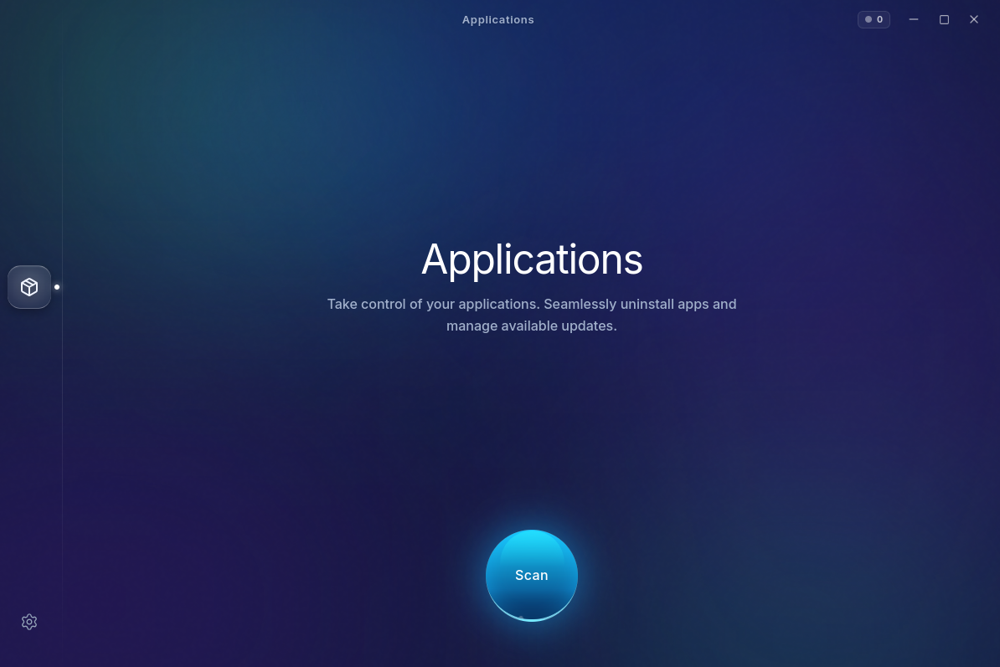

# CleanMyLinux

<p align="center">
  <a href="https://tauri.app/"></a>
  <a href="https://www.rust-lang.org/"></a>
  <a href="https://react.dev/"></a>
  
  <a href="LICENSE"></a>
</p>

CleanMyLinux is a premium system maintenance and application management tool designed specifically for Linux desktop environments. It provides a beautiful, unified, and safe way to keep your Linux system clean, fast, and up to date.

## Preview



---

## Supported Distributions

CleanMyLinux is natively compiled and supports the following Linux distributions. Due to modern C library dependencies (GLIBC baseline), older system versions are not supported.

| Distribution | Minimum Supported Version |
| :--- | :--- |
| **Ubuntu** | `22.04 LTS` (Jammy Jellyfish) or newer |
| **Debian** | `12` (Bookworm) or newer |
| **Fedora** | `40` or newer |
| **Arch Linux** | `latest` (Not tested yet) |
| **Linux Mint** | `21` or newer |
| **Pop!_OS** | `22.04 LTS` or newer |
| **Zorin OS** | `17` or newer |
| **Parrot OS** | `6` or newer |
| **Elementary OS** | `7` (Horus) or newer |

> [!WARNING]
> **GLIBC Version Constraint:** If your distribution has a GLIBC version older than `2.39` (e.g. Ubuntu 20.04, Debian 11, CentOS 8), the pre-compiled binary will fail to launch. For older platforms, we recommend compiling the application directly from source (see *Build and Run* below).

---

## Key Features

### Safe Application Uninstaller
Traditional package managers list thousands of complex system libraries and drivers. CleanMyLinux uses intelligent filtering to show you only the actual software applications you use.
*   **Automatic Protection**: Critical system utilities, configurations, and core services are automatically hidden and locked to prevent accidental system damage.
*   **Usage Tracking**: See exactly which applications you haven't opened in months to easily reclaim storage space.

### Universal Updates
Keep your entire system up to date with a single click. CleanMyLinux manages updates across all popular packaging formats:
*   **Native Packages**: Support for Debian/Ubuntu (`APT`), Arch Linux (`Pacman`), and Fedora/Red Hat (`DNF`).
*   **Sandboxed Containers**: Full tracking for modern containerized applications via `Flatpak` and `Snap`.

### Uncompromising Security
CleanMyLinux is designed to keep your system safe. The main graphical interface runs entirely as a standard unprivileged user. Whenever administrative tasks are required (such as removing a native package), the app requests secure, localized system authentication via PolicyKit.

---

## Build and Run

### Development Prerequisites
Ensure your build environment has Rust, Bun (or Node.js), and system GTK development headers:
*   **Arch Linux**: `sudo pacman -S webkit2gtk-4.1 gtk3 base-devel`
*   **Debian/Ubuntu**: `sudo apt install libwebkit2gtk-4.1-dev build-essential curl libssl-dev libgtk-3-dev`
*   **Fedora**: `sudo dnf install webkit2gtk4.1-devel gtk3-devel && sudo dnf groupinstall "Development Tools"`

### Execution Commands
1.  **Initialize JS Dependencies**:
    ```bash
    bun install
    ```
2.  **Launch Live Development Server**:
    ```bash
    bun run tauri dev
    ```
3.  **Compile Production Release**:
    ```bash
    bun run tauri build
    ```

---

## Technical Architecture

For developers, contributors, and systems engineers interested in the mathematical details, machine learning weights, and security models powering the application, please refer to the [Technical Architecture Specification](docs/architecture.md).

---

## Project Roadmap

*   **Phase 1: Foundation (Completed)**
    *   Project scaffolding (Tauri v2 + React + TypeScript).
    *   Dashboard navigation layouts, sidebars, and dark/light theming.
*   **Phase 2: App Management (Completed)**
    *   Application discovery across native systems (`apt`/`dnf`/`pacman`), Flatpaks, and Snaps.
    *   Per-application disk usage analysis (binary size + local caches + configurations).
    *   Complete uninstallation (package removal and cleanup of residual configuration traces).
    *   App resetting (erasing local cache/config footprint while keeping the program installed).
*   **Phase 3: System Junk Cleaner (Current Focus)**
    *   Scan and safely remove system package manager caches (`apt`, `dnf`, `pacman`).
    *   Identify and clear user cache folders (`~/.cache/*`), old system logs, and temporary files.
    *   Manage system trash bins and unused container runtimes (`flatpak uninstall --unused`).
*   **Phase 4: Disk Analysis**
    *   Large & Old File Finder (scanning directories for files over threshold size and age limits).
    *   Space Lens interactive treemap disk usage visualizer.
    *   Duplicate file detection engine.
*   **Phase 5: System Tools & Distribution**
    *   Startup Manager (managing systemd user services and XDG autostart entries).
    *   Real-time system health and resource consumption monitors.
    *   Cross-distribution package generation (`.deb`, `.rpm`, `.AppImage`, Flatpak).

---

**It's time to evolve Linux.**

*Crafted with passion by the Better Linux Community.*
